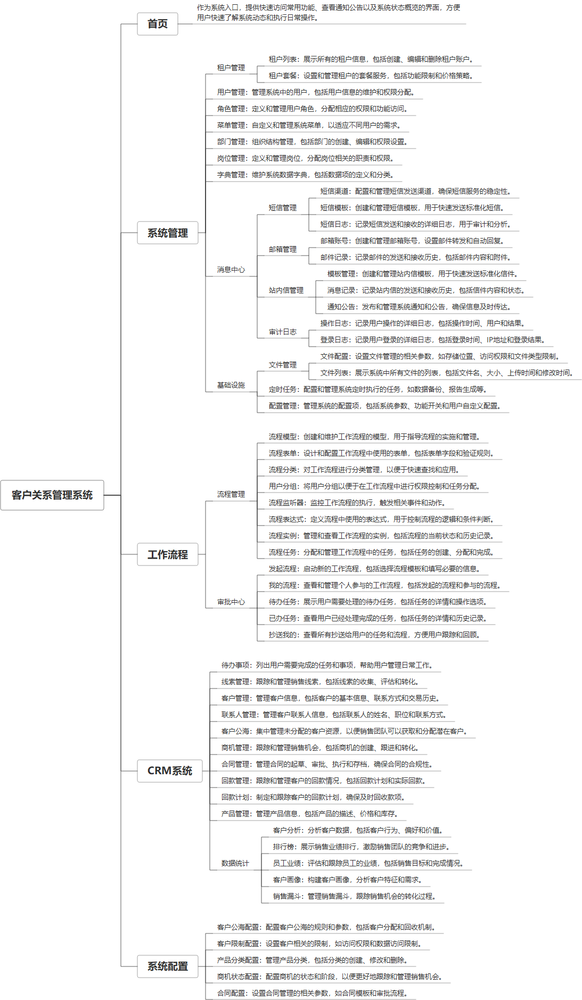

 

    
 

公司拥有上百套具有自主知识产权的软件系统，详情请查看码云首页或公司官网

 
<h1>客户关系管理系统</h1>

<a href="https://www.haishi.net.cn/">公司官网</a> ｜ <a href="https://www.haishi.net.cn/">在线体验</a>

 

## 系统介绍

CRM系统（客户关系管理系统）是一款集客户信息管理、销售管理、服务支持于一体的综合管理平台，它通过优化客户互动、提升销售效率和增强客户忠诚度，帮助企业更好地管理客户关系。系统功能包括客户资料维护、销售机会跟踪、营销活动管理、客户服务记录、会员签到管理、数据分析统计等，旨在通过全面的数据支持和流程自动化，提升企业的客户满意度和市场竞争力。
CRM系统（客户关系管理系统）是一款集客户信息管理、销售管理、服务支持于一体的综合管理平台，它通过优化客户互动、提升销售效率和增强客户忠诚度，帮助企业更好地管理客户关系。系统功能包括客户资料维护、销售机会跟踪、营销活动管理、客户服务记录、会员签到管理、数据分析统计等，旨在通过全面的数据支持和流程自动化，提升企业的客户满意度和市场竞争力。
本项目名称为CRM客户关系管理系统，是一款面向企业级用户的客户关系管理系统。该系统旨在帮助企业全面管理客户信息、销售过程、合同回款等业务流程，提升客户满意度和销售业绩。系统功能涵盖了待办事项、线索管理、客户管理、商机管理、合同管理、产品管理、数据统计等核心模块，并提供灵活的系统配置功能，以满足不同企业的个性化需求。
                

## 系统功能介绍

### 系统包含终端说明

管理端（WEB）

| 序号 | 模块              | 模块说明 |
| ---- | ----------------- | -------- |
| 1    | QHY-CRM-YD-SERVER | 服务端   |
| 2    | QHY-CRM-YD-MANAGE | 管理端   |

### 系统功能结构

### 系统功能说明

- **客户关系管理**:  提供从线索到客户的全生命周期管理，包括线索管理、客户管理、联系人管理、客户公海、商机管理等功能，帮助企业建立和维护良好的客户关系。
- **销售过程管理**:  支持商机跟进、合同管理、回款管理等功能，实现对销售过程的全程跟踪和管理，提高销售转化率。
- **数据分析**:  提供客户分析、排行榜、员工业绩、客户画像、销售漏斗等数据统计功能，帮助企业全面了解客户情况、销售状况和员工绩效，为经营决策提供数据支持。
- **系统配置**:  提供客户公海配置、客户限制配置、产品分类配置、商机状态配置、合同配置等系统配置功能，满足不同企业的个性化需求。

## 系统主要界面

## 系统技术说明

### 代码模块说明

| 序号 | 目录                                  | 目录说明 |
| ---- | ------------------------------------- | -------- |
| 1    | QHY-CRM-YD-SERVER/crmyd-server        | --       |
| 2    | QHY-CRM-YD-SERVER/crmyd-framework     | --       |
| 3    | QHY-CRM-YD-SERVER/crmyd-module-system | --       |
| 4    | QHY-CRM-YD-SERVER/crmyd-module-infra  | --       |
| 5    | QHY-CRM-YD-SERVER/crmyd-dependencies  | --       |
| 6    | QHY-CRM-YD-SERVER/crmyd-module-bpm    | --       |
| 7    | QHY-CRM-YD-SERVER/.image              | --       |
| 8    | QHY-CRM-YD-SERVER/crmyd-module-crm    | --       |
| 9    | QHY-CRM-YD-SERVER/.idea               | --       |

### 系统技术选型

#### 开发语言/框架

JAVA（JDK1.8）
脚手架：芋道
框架：SpringBoot2.x
系统结构：单体应用
前端框架：VUE3

#### 服务中间件

Nginx
Tomcat

#### 数据库

MySQL（5.7+）

#### 其他说明

无

## 系统演示/商用

请扫码添加客服微信获取演示地址和系统详细资料。

如果您想基于客户关系管理系统进行商业化交付或定制开发服务，我们提供有偿的技术服务支持，合作模式不限，欢迎沟通！

公司官网地址： <a href="https://www.haishi.net.cn/">https://www.haishi.net.cn</a>

联系客服获取专业回答。

## 使用须知

1、 本项目商用必须获得版权所有者的授权。

2、 未经允许本项目代码不允许二次出售。

